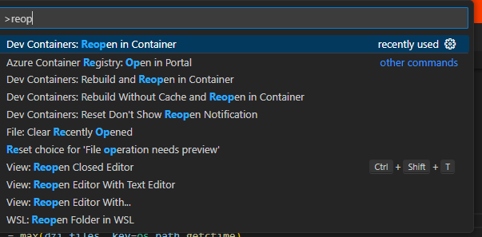

# JPG2000 Web Viewer - Server

## Description 
This application serves as a web-based viewer for JPG2000 images, utilizing the FastAPI framework to provide backend services. The system facilitates the uploading and processing of JPG2000 images, dynamically generating Deep Zoom Images (DZI) to enable efficient, high-quality viewing experiences on the web. Designed with a focus on performance and scalability, the API ensures a seamless integration with front-end applications, providing a robust solution for managing and displaying high-resolution images in various web environments.

## Getting Started

### Prerequisites

- Docker
- Git
- Visual Studio Code with the Remote 
- Extensions
  
   
   

### Setup

1. Clone the repository:
   \`\`\`
   git clone <repository-url>
   \`\`\`
2. Open the project folder in Visual Studio Code.
3. When prompted by Visual Studio Code, re-open the folder in a container.

### Running the Application

1. Start the FastAPI server:
   \`\`\`
   uvicorn main:app --reload
   \`\`\`
   The server will be available at `http://localhost:8000`.

2. Access the automatically generated API documentation at:
   \`\`\`
   http://localhost:8000/docs
   \`\`\`

## API Endpoints

- POST `/upload/`: Upload an image file and generate a Deep Zoom Image (DZI).
- GET `/api/get_dzi_info`: Get information about the most recently generated DZI.
- GET `/dzi/{filename}`: Access a specific DZI file.

## Project Structure

- `main.py`: The FastAPI application entry point.
- `temp/`: Temporary folder for uploaded images.
- `dzi/`: Directory where generated DZI files are stored.
- `.dockerfile`: Docker configuration file for setting up the development environment.

