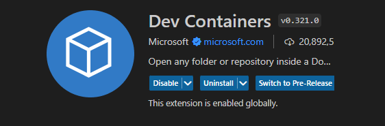

# JP200 WEB VIEWER - SERVER 

## Description

This project provides an API for image processing using the FastAPI framework. It is designed to be run within a containerized development environment to ensure consistent development and deployment workflows.

## Getting Started

### Prerequisites

- Docker
- Git
- Visual Studio Code with the Remote 
- Extensions
  
   
   

### Setup

1. Clone the repository:
   \`\`\`
   git clone <repository-url>
   \`\`\`
2. Open the project folder in Visual Studio Code.
3. When prompted by Visual Studio Code, re-open the folder in a container.

### Running the Application

1. Start the FastAPI server:
   \`\`\`
   uvicorn main:app --reload
   \`\`\`
   The server will be available at `http://localhost:8000`.

2. Access the automatically generated API documentation at:
   \`\`\`
   http://localhost:8000/docs
   \`\`\`

## API Endpoints

- POST `/upload/`: Upload an image file and generate a Deep Zoom Image (DZI).
- GET `/api/get_dzi_info`: Get information about the most recently generated DZI.
- GET `/dzi/{filename}`: Access a specific DZI file.

## Project Structure

- `main.py`: The FastAPI application entry point.
- `temp/`: Temporary folder for uploaded images.
- `dzi/`: Directory where generated DZI files are stored.
- `.dockerfile`: Docker configuration file for setting up the development environment.

